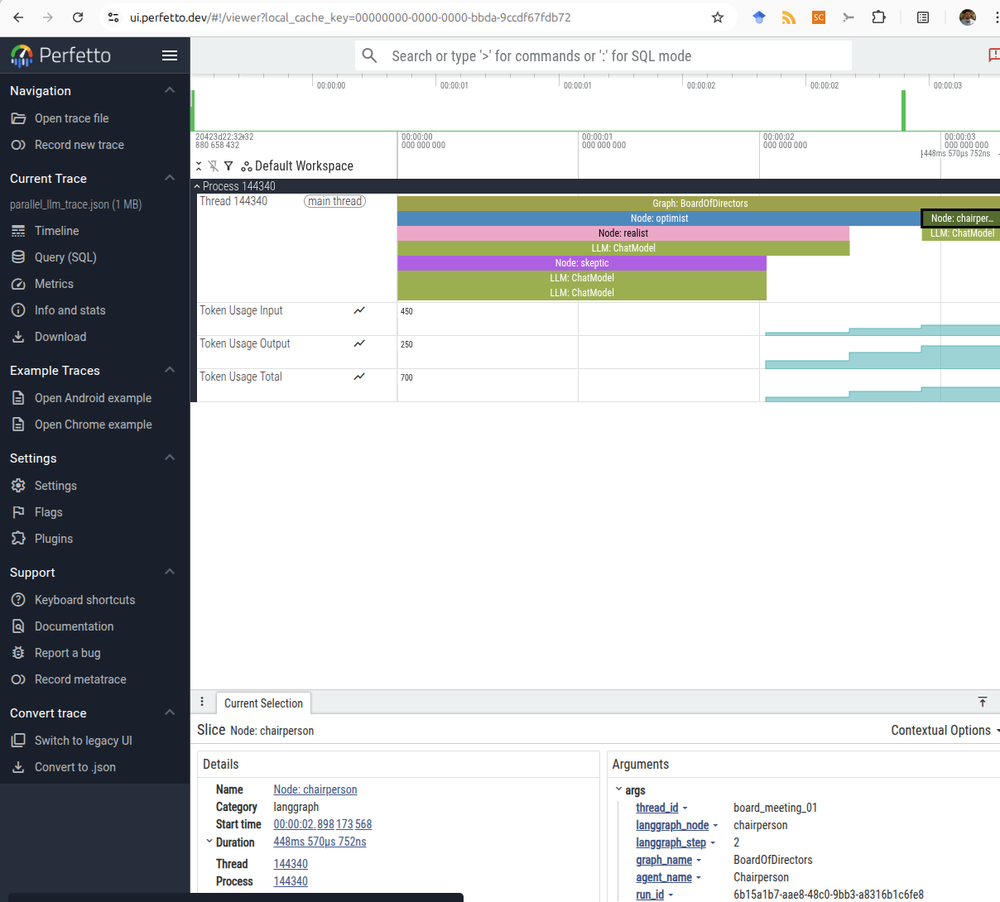
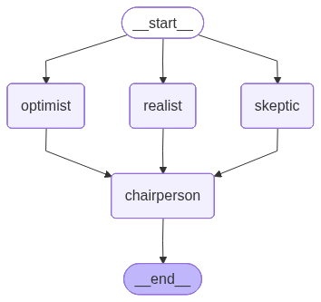

# LangGraph Instrumentation

Instrumentation for understanding LangGraph agent execution locally in
[Perfetto](https://ui.perfetto.dev), with a staged refactor toward interchangeable
trace stores and observability exporters.

The current release contains the characterized prototype API. The modular
architecture, SQLite persistence, and OTLP support are tracked in
[`EPIC_REFACTOR.md`](EPIC_REFACTOR.md) and GitHub epic
[#1](https://github.com/mylonasc/langgraph_instrumentation/issues/1).

## Development Setup

This project uses [uv](https://docs.astral.sh/uv/) for dependency management,
virtual environments, locking, and builds. Python 3.12 or newer is required.

```bash
uv sync --group dev
uv run pytest
uv run ruff check .
uv run ruff format --check .
uv run ty check
uv build --out-dir dist
```

Install optional example dependencies with:

```bash
uv sync --group dev --extra examples
```

The future OTLP implementation has its own optional dependency set:

```bash
uv sync --extra otlp
```

`uv.lock` is committed so local development and CI resolve the same dependency
versions.

## Current API

```python
from langgraph_instrumentation import (
    LangGraphInstrumentationHandler,
    PerfettoLogger,
    PerfettoTracer,
)

tracer = PerfettoTracer(process_name="langgraph-agent")
logger = PerfettoLogger()
callback = LangGraphInstrumentationHandler(tracer=tracer, logger=logger)

# Pass callback through a LangGraph invocation config:
# app.invoke(inputs, config={"callbacks": [callback]})

tracer.save("trace.json")
```

Open the generated JSON file in `ui.perfetto.dev`.

The public API above is retained only while its behavior is characterized. The
epic intentionally introduces a clean-break recorder/store/exporter API rather
than permanent compatibility wrappers.

## Neutral Trace Records

The first refactor stage provides exporter-independent, immutable domain
records. Trace IDs are non-zero 128-bit values and span IDs are non-zero 64-bit
values, serialized as fixed-width lowercase hexadecimal strings.

```python
from langgraph_instrumentation import Span, SpanId, SpanKind, TraceId

span = Span(
    trace_id=TraceId(1),
    span_id=SpanId(1),
    name="Graph: demo",
    kind=SpanKind.GRAPH,
    start_time_unix_ns=1_000,
    start_time_monotonic_ns=100,
)

payload = span.to_dict()
restored = Span.from_dict(payload)
assert restored == span
```

`Trace`, `Span`, `SpanEvent`, `MetricPoint`, `TraceBundle`, `TraceSummary`, and
`TraceQuery` expose explicit `to_dict()` and `from_dict()` methods. Their output
contains only JSON-compatible values. Attribute mappings are validated and
deeply frozen when records are constructed, so later mutation of caller-owned
objects cannot change a stored trace.

Use `SystemClock` and `RandomIdGenerator` in production. `DeterministicClock`
and `DeterministicIdGenerator` support repeatable tests without sleeps or random
fixtures.

## Capture Safety

`CapturePolicy` controls whether instrumentation retains no payload, structural
metadata only, bounded content, or full content. Metadata-only capture is the
default and records sizes/types rather than prompt, response, state, or tool
bodies.

```python
from langgraph_instrumentation import CapturePolicy, MessageProjector

projector = MessageProjector(capture=CapturePolicy.metadata())
```

`Sanitizer` applies depth, string, byte, and collection bounds and safely handles
cycles and unsupported objects. `RedactionPolicy` removes common secret fields
case-insensitively and supports custom predicates. `MetadataProjector` controls
which framework metadata keys are retained, while `UsageExtractor` normalizes
common provider token-usage shapes.

Full capture is explicit and may retain sensitive application data. Redaction
still applies in full mode.

## Examples

Provider-backed demonstrations live under `examples/` and are not imported by
the library:

```bash
uv run --extra examples python examples/run_parallel.py
```

The parallel example expects Ollama and the configured model to be available.
The ReAct example expects an OpenAI credential. Tests never require either.

Example Perfetto output:



Corresponding graph:



## Planned Architecture

The refactor separates four concerns:

- A LangGraph callback adapter translates framework callbacks.
- A recorder manages trace and span lifecycle.
- A `TraceStore` persists neutral records in memory, SQLite, or future stores.
- Exporters translate neutral records to Perfetto or OTLP.

See `EPIC_REFACTOR.md` for feature dependencies, design constraints, and
acceptance scenarios. Deferred non-blocking work is tracked in
[FRK-Techdept #12](https://github.com/mylonasc/langgraph_instrumentation/issues/12).

## OpenInference Alternative

[OpenInference](https://github.com/Arize-ai/openinference) provides automatic
OpenTelemetry instrumentation by patching LangChain/LangGraph integrations. It
is a useful alternative when local Perfetto export, explicit trace storage, or
the component boundaries planned by this project are not required.
