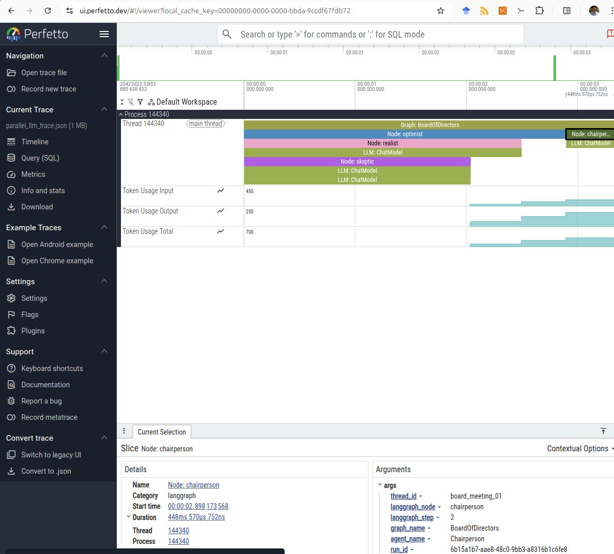
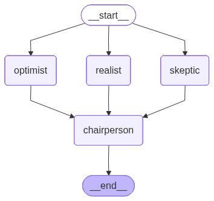

## Instrumentation for use with Perfetto (`ui.perfetto.dev`) 
Perfetto is the default profiler for android, but very popular profiler for local performance dedugging. 
I.e., it is meant to be used for checking isolated traces and explicitly instrumented parts of the code. 
Although there is an automated general instrumentation library for python, there is no support for Langgraph so I wrote one.

See the `main_parallel.py` for an example instrumentation using the middleware approach. 

### Example output



corresponding graph:




## OpenTelemetry instrumentation using the `openinference` library

For OpenTelemetry instrumentation, the prefered method is using the openinference library.

Openinference patches parts of Langgraph so that it emits the required traces to the OTEL collector server.


```python
from opentelemetry import trace
from opentelemetry.sdk.trace import TracerProvider
from opentelemetry.sdk.trace.export import BatchSpanProcessor
from opentelemetry.exporter.otlp.proto.grpc.trace_exporter import OTLPSpanExporter
from opentelemetry.sdk.resources import Resource

# The "Standard" Auto-Instrumentor
from openinference.instrumentation.langchain import LangChainInstrumentor

def setup_otlp_instrumentation(endpoint="http://localhost:4317"):
    # 1. Standard OTel Provider Setup
    resource = Resource(attributes={"service.name": "langgraph-agent"})
    tracer_provider = TracerProvider(resource=resource)
    tracer_provider.add_span_processor(
        BatchSpanProcessor(OTLPSpanExporter(endpoint=endpoint, insecure=True))
    )
    trace.set_tracer_provider(tracer_provider)

    # 2. AUTO-INSTRUMENTATION
    # This magically patches LangChain/LangGraph to emit OTel traces
    LangChainInstrumentor().instrument()

# --- USAGE ---
if __name__ == "__main__":
    setup_otlp_instrumentation()
    
    # Run your LangGraph code normally

```
